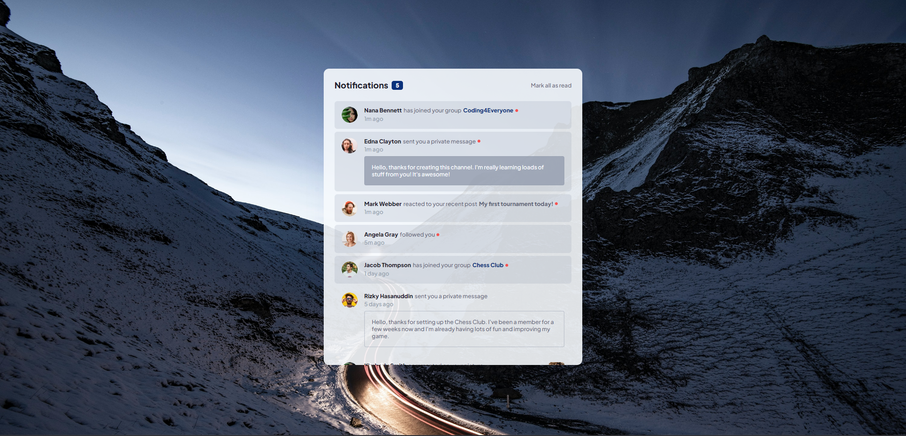

# Frontend Mentor - Notifications page solution

This is a solution to the [Notifications page challenge on Frontend Mentor](https://www.frontendmentor.io/challenges/notifications-page-DqK5QAmKbC). Frontend Mentor challenges help you improve your coding skills by building realistic projects.

## Table of contents

- [Overview](#overview)
  - [The challenge](#the-challenge)
  - [Screenshot](#screenshot)
  - [Links](#links)
- [My process](#my-process)
  - [Built with](#built-with)
  - [What I learned](#what-i-learned)
- [Author](#author)
- [Acknowledgments](#acknowledgments)

## Overview

### The challenge

Users should be able to:

- Distinguish between "unread" and "read" notifications
- Select "Mark all as read" to toggle the visual state of the unread notifications and set the number of unread messages to zero
- View the optimal layout for the interface depending on their device's screen size
- See hover and focus states for all interactive elements on the page
- Able to append/add as many notifications in the json file and the interface will still work i.e. show and update the number of unread notifications

### Screenshot

- Original: 

- After adding new notifications: 

### Links

- Solution URL: [https://github.com/Jo-cloud85/notifications-page.git](https://github.com/Jo-cloud85/notifications-page.git)
- Live Site URL: [https://jo-cloud85.github.io/notifications-page/](https://jo-cloud85.github.io/notifications-page/)

## My process

### Built with

- Semantic HTML5 markup
- CSS custom properties
- Flexbox
- CSS Grid
- Mobile-first workflow
- [Styled Components](https://styled-components.com/) - For styles

### What I learned

On the first glance, this is a simple challenge with little javascript requirements and bulk of the requirements can be met using HTML & CSS alone.

However, I wanted to give myself more challenge by making this notification page slightly 'smarter'. The whole idea is not to rely on HTML for static information, but to instead transfer the data on the HTML file and put them into a json file where I can iterate using Javascript and even add more information if I want to. This is also to brush up my Javascript skills.

I started by noticing that there is a pattern in the notification messages and use it to sort the data into key-value pairs in the json file. This allows me to set up a for loop and conditional statements to check for certain conditions and update the interface accordingly.

Next would be to draft out the expected html structure you want to see when each of the conditions happen. This guided me how to structure my lines in javascript.

The for loop is a reverse one because the data in the json file is the reverse of what users see on the interface. If there are new notifications coming in, usually it appears at the top of the interface. However, in the json file, it is appended at the end of the list of the data. Thus, when iterating through the number of items in the data, we have to do the reverse way. It might seemed like a counter-intuitve step as information like time is still static in this case. Nevertheless, for this purpose, it is to allow users to add information to test the page. Of course, the 'smartes' way to make this page work will have to involve integrating a clock and doing backend stuff.

The trickiest part for me in this whole approach comes in the sequencing. The sequence of which the elements or divs gets added to the main div step by step is very important. In addition, it is crucial to know which item(s) need to happen within the for loop, which ones have to happen outside the for loop. The 'redDot' is a key example.

Overall, I am glad I gave myself this challenge and made it through. I hope this will set a foundation for me when I am more familiarize with backend technologies like node.js and mongoDB, as well as, APIs.

- Expected html structure to serve as guide for js file
```
<div class="nBox">
  
  <div class="info">
    <div class="activity">
      <span class="name"></span>
      <span class="activity-r"></span>
      <span class="activity-d"></span>
      <span class="red-dot"></span> only added if status is unread
    </div>
    <p class="time"></p>
    <div class="privateMsg"> only added if last word activity-r is 'message'
      <p class="privateMsg-text"></p>
    </div>
  </div>
   only added if last word activity-r is 'picture'
</div>
```

## Author

- Frontend Mentor - [@Jo-cloud85](https://www.frontendmentor.io/profile/Jo-cloud85)

## Acknowledgments

Background photo by [Jonathan Bean on Unsplash](https://unsplash.com/photos/sbZU1j31ggE)
